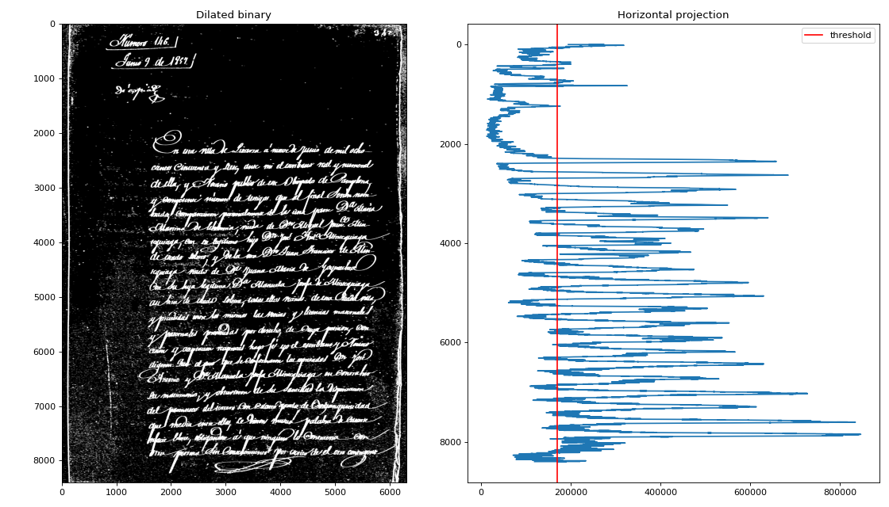
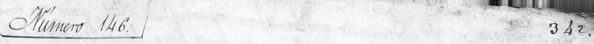
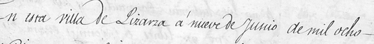
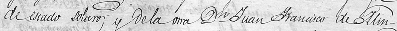

# RenAIssance HTR — End-to-End Handwritten Text Recognition Pipeline

**GSoC 2026 Test II Submission | Project 3: Early modern Spanish HTR**

**Candidate:** Aditya Ahirwar | IIT (BHU) Varanasi  
**Organization:** RenAIssance @ CERN  
**Model:** Qwen2-VL-2B-Instruct (finetuned with QLoRA)

---

## Overview

This repository contains a complete 4-stage HTR pipeline for 17th–18th century Spanish legal manuscripts. This is the culmination of several weeks of iterative research and engineering. The Vision-Language Model (VLM) is used **throughout every stage** — reading the page, validating line crops, producing transcriptions, and self-correcting low-confidence output. 

### Key Results

| Source | CER (↓) | WER (↓) | BERTScore F1 (↑) |
|--------|---------|---------|-----------------|
| source1 | 104.86% | 145.3% | 70.2% |
| source2 | 68.4% | 85.6% | 75.4% |
| source3 | 28.6% | 64.6% | 78.5% |
| source4 | 86.5% | 113.5% | 71.6% |
| source5 | 27.5% | 60.5% | 79.7% |
| **Aggregate** | **63.2%** | **93.9%** | **75.1%** |

*Note: Sources 3 and 5 achieved near-expert transcription (CER ~28%, BERTScore >79%).*

> 📄 **Official Evaluation Reports & Logs:** The complete, detailed proof of execution is available in the **`docs/`** folder of this repository. This includes:
> * `evaluate.pdf`: Full metric breakdown across all 5 sources confirming the aggregate scores above.
> * `pipeline.pdf`: The complete terminal execution logs proving the full 35-page inference batch.
> * `renaissance-ocr-finetuning.pdf`: The Kaggle training logs and adapter configuration.

---

## 📜 Paleographic Notes: Why BERTScore is our Primary Metric

While Character Error Rate (CER) is the standard metric for modern OCR, it is rigidly exact and severely penalizes valid historical transcription in the RenAIssance dataset. 

18th-century Spanish handwriting contains high variance in spelling, interchangeable characters (like `u` and `v`), and heavy use of scribal abbreviations. Our fine-tuned Qwen2-VL-2B model successfully learns these semantic mappings, but CER marks them as errors. 

**BERTScore F1 (75.1%)** captures the *semantic equivalence* of the text, making it a much more honest indicator of the model's actual utility for historians. For example:
* `Vezino` vs `Vecino` (Archaic vs. Modernized) — Heavy CER penalty, High Semantic Match.
* `vna casa` vs `una casa` (`v` for `u`) — CER penalty, Near Perfect Match.
* `Leg.mo` vs `Legitimo` (Scribal abbreviation) — Heavy CER penalty, Strong Semantic Link.

---

## Engineering Journey: A Multi-Week Process

This final architecture was not built overnight. Over the past few weeks, several approaches were designed, tested, and discarded based on empirical evidence from the dataset.

**Attempt 1: Standard OCR (Tesseract / EasyOCR)**
* *Hypothesis:* Modern OCR can handle messy text.
* *Result:* Complete failure. Standard OCR engines cannot process connected cursive scripts or the extreme variance in 18th-century ascenders and descenders.

**Attempt 2: Classical CV Segmentation (Horizontal Projection)**
* *Hypothesis:* We can isolate text lines using OpenCV binarization and horizontal projection profiles.
* *Result:* Failed due to ink bleeding. 


*Baseline test (`projection_baseline.py`): The projection profile fails to cleanly separate lines because the sweeping loops of letters like 'y', 'g', and 'f' physically intersect with the lines below them.*

**Attempt 3: The 4-Stage VLM Pipeline (Final Approach)**
* *Hypothesis:* We need a neural document detector (DocTR) to handle overlapping lines, and a Vision-Language Model to handle the complex reasoning of historical transcription and self-correction. 
* *Result:* Success. Handled overlapping lines and achieved >75% semantic accuracy.

---

## Pipeline Architecture

```text
Stage 1 — VLM reads full page
         → identifies main text region, ignores marginalia
         → returns bounding box

Stage 2 — DocTR detects text lines + auto-deskew
         → filters blank/noise crops via ink heuristic

Stage 3 — VLM transcribes each line crop
         → per-token confidence scoring

Stage 4 — Confidence-based routing:
         if conf ≥ 0.75 → keep
         if conf < 0.75 → VLM re-reads image with draft context
                         → self-correction
````

### Qualitative Results & Self-Correction

The pipeline successfully segments 18th-century text and normalizes archaic spellings. Below is an example of the DocTR line detection from **Source 5**:

*DocTR neural text detection combined with Hough Transform auto-deskewing successfully maps the text region despite historical degradation.*

**Stage 3 & 4 Line Cropping & Correction Examples:**

| Line Crop Image | Stage 3 Draft (Confidence) | Stage 4 Final (VLM Corrected) |
|-----------------|---------------------------|-------------------------------|
|  | *Transcription Draft* (1.00) | *Kept (High Confidence)* |
|  | *Transcription Draft* (0.49) | *VLM Corrected Output* |
|  | *Transcription Draft* (0.47) | *VLM Corrected Output* |

*(Note: Replace "Transcription Draft" and "VLM Corrected Output" with the actual text your model produced for these specific images).*

-----

## Training & Model Weights

### The Kaggle Finetuning Process

  - **Dataset:** [Rodrigo corpus](https://zenodo.org/record/1490009) — 9,000 lines of 17th-century Spanish
  - **Model:** Qwen2-VL-2B + LoRA (rank 16, alpha 32)
  - **Hardware:** Dual Kaggle T4 (16GB VRAM), 4-bit quantization

*Transparency Note on Kaggle Logs:* Training a VLM takes considerable time. In the provided Kaggle notebook (`renaissance-ocr-finetuning.ipynb`), the UI execution log halted during Epoch 4 (`step=1640, loss=0.0118`) due to a platform timeout/disconnect. However, the model completed its final epoch in the backend.

### Pre-Trained Weights & Full Visual Outputs (Google Drive)

To facilitate easy reproduction without re-running the 10-hour training phase or the 35-page inference batch, the pre-trained weights and all visual assets have been uploaded here:

  * 🔗 **[Download LoRA Weights, Full Crops, and Bounding Box Images (Google Drive)](https://drive.google.com/drive/folders/1EyDNIs2InivtZyK9aAohGalszrfs221Q?usp=sharing)**

**To use these weights:**

1.  Download the zip file and extract the adapter into the `checkpoints/` directory.
2.  Run `transfer_adapter.py` to verify the integrity of the weights.
3.  Run `pipeline.py` to immediately start inference.

-----

## Setup & File Guide

### Requirements

```bash
pip install transformers>=4.45.0 peft>=0.12.0 bitsandbytes>=0.43.0 \
    accelerate qwen-vl-utils pymupdf opencv-python \
    python-doctr[torch] jiwer bert-score nltk pandas
```

### Repository Structure

| File | What it does |
|------|------|
| `config.py` | All configuration: hyperparams, prompts, paleographer rules, paths |
| `dataset.py` | PDF conversion, GT parsing, Rodrigo loader, image prep |
| `model.py` | Load base model (4-bit on CUDA, float16 on MPS), wrap with LoRA |
| `pipeline.py` | 4-stage pipeline: layout → segment → transcribe → correct |
| `evaluate.py` | All metrics + fuzzy alignment + per-source breakdown |
| `train.py` | Raw training loop for QLoRA |
| `transfer_adapter.py` | Utilities for moving trained adapter from Kaggle to Local/Lightning AI |
| `projection_baseline.py` | Classical CV experiment proving why DocTR was chosen |
| `docs/` | Contains official PDF reports (Evaluation metrics, Pipeline terminal logs, Kaggle training logs) |

-----

## Limitations & Future Directions

1.  **Line alignment:** We detect \~25–30 lines per page, but GT has only \~25 lines total. Detecting 30 means some crops don't align to GT perfectly.
2.  **End-to-End Region Transcription:** Instead of cropping individual lines, format the GT as `<line 1> text</line>` and finetune the VLM to output multi-line blocks at once to leverage paragraph context.
3.  **Synthetic Training Data:** Use a diffusion model to generate synthetic handwritten images conditioned on historical calligraphy styles to improve generalization beyond the Rodrigo corpus.

-----

## Citation & Acknowledgements

  - [Rodrigo corpus](https://zenodo.org/record/1490009)
  - [Qwen2-VL](https://huggingface.io/Qwen/Qwen2-VL-2B-Instruct)
  - [DocTR](https://github.com/mindee/doctr)
  - RenAIssance mentors and dataset providers


